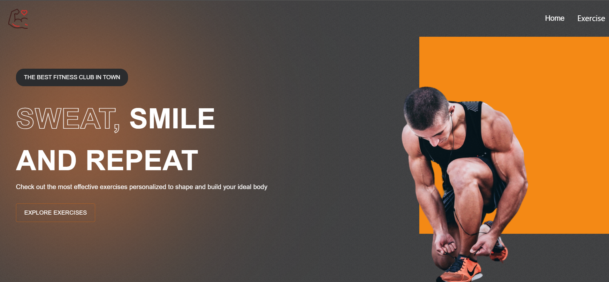

This is a fitness app built using React.js, material ui and an exercise db Api found in Rapid Api.
 One can search for exercises based on the body part they want to target.

### How to Use
clone this repository to your local machine using the following command:
git clone <https://github.com/estherlardze/fitness_hub.git>

Navigate to the project directory and install the required dependencies using npm:
cd fitness_hub
npm install

Once the dependencies are installed, start the development server:
### `npm start`

